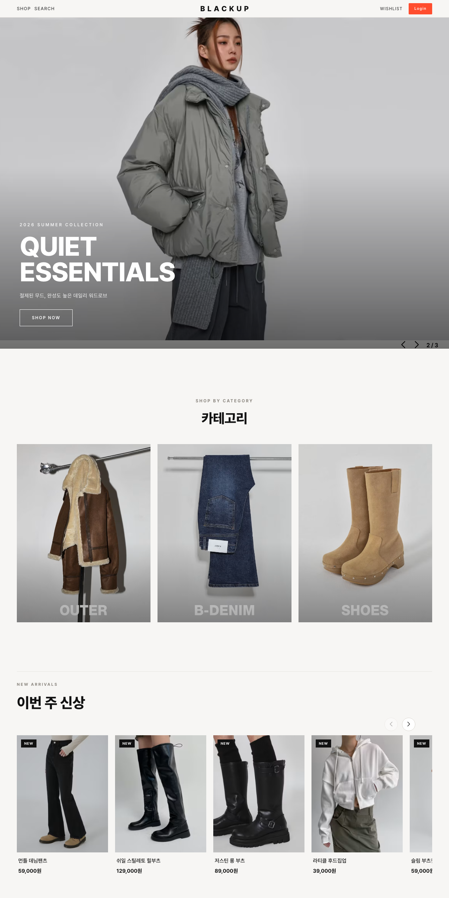
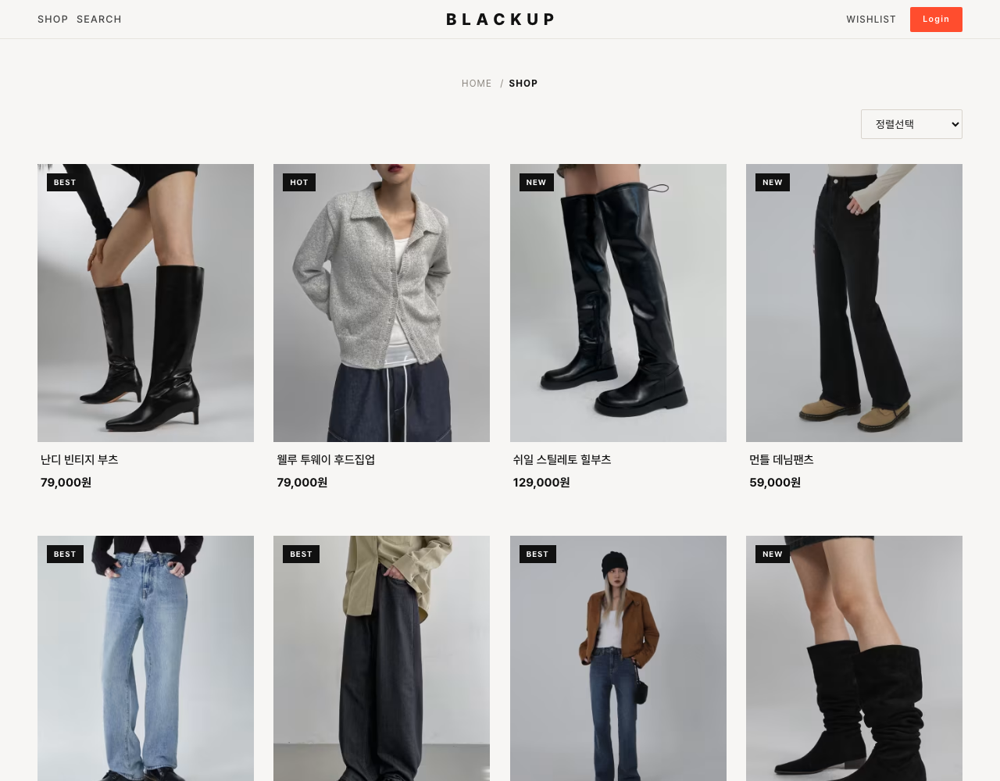

<div align="center">

# 🛍 SHOPPY

**React 기반 패션 커머스 웹 애플리케이션**

소셜 로그인 · 상품/장바구니/위시리스트 · 관리자 상품 등록까지,
실제 쇼핑몰의 핵심 플로우를 React Query · Firebase · Cloudinary로 구현한 SPA입니다.

<br/>


</div>

<br/>



---

## 📌 프로젝트 개요

| 항목 | 내용 |
| --- | --- |
| **유형** | 개인 포트폴리오 프로젝트 (패션 셀렉트샵 클론 → 자체 디자인 리뉴얼) |
| **기간** | 기능 구현 → 성능 최적화 → **디자인 시스템 리뉴얼** 단계로 진행 |
| **인원** | 1인 (기획 · 개발 · 디자인) |
| **저장소** | <https://github.com/byeonsejun/shoppy> |

> 초기엔 디자인 레퍼런스를 클론하며 기능을 구현했고, 이후 **Core Web Vitals 성능 개선**과
> **자체 디자인 시스템(Refined Mono) 리뉴얼**을 거치며 완성도를 끌어올린 프로젝트입니다.

---

## ✨ 주요 기능

| 도메인 | 기능 |
| --- | --- |
| **인증** | Google · Facebook 소셜 로그인, 로그인 상태 전역 관리, **관리자(admin) 권한 분기** |
| **상품** | 카테고리(OUTER/DENIM/SHOES)별 조회, **검색**, 가격순 **정렬**, 상세 페이지(옵션 선택) |
| **장바구니** | 담기 / 수량 변경 / 삭제, 상품 합계 · 배송비 · 총 결제금액 요약 (사용자별 서버 동기화) |
| **위시리스트** | 하트 토글로 담기/해제 (`localStorage` 기반, 비로그인도 사용 가능) |
| **관리자** | 이미지 업로드 + 상품 등록 (admin 전용 보호 라우트) |
| **UX** | 메인 풀스크린 히어로, 카테고리 쇼케이스, **스크롤 연동 가로 갤러리**, 반응형 레이아웃 |

---

## 🛠 기술 스택

**Frontend**
- **React 18** (Create React App) · **React Router v6** (`createBrowserRouter`, 중첩 라우트)
- **@tanstack/react-query v4** — 서버 상태(상품·장바구니) 관리 및 캐싱
- **Tailwind CSS** + **CSS Modules** — 유틸리티 + 컴포넌트 단위 스타일 병행

**Backend / Infra**
- **Firebase Authentication** — 소셜 로그인(OAuth)
- **Firebase Realtime Database** — REST API + 토큰 인증으로 직접 통신
- **Cloudinary** — 이미지 업로드 및 URL 기반 변환(리사이즈/포맷) CDN

**기타** — `swiper`(슬라이더), `react-icons`, `react-spinners`, `uuid`

---

## 🧩 아키텍처

```text
src/
├── api/
│   ├── firebase.js      # Auth + Realtime DB(REST) + 권한 판별 로직
│   └── uploader.js      # Cloudinary 이미지 업로드
├── context/
│   └── AuthContext.jsx  # 로그인 상태 · 소셜 로그인 · admin 정보 전역 제공
├── hooks/
│   ├── useProducts.jsx  # 상품 조회/등록 (react-query)
│   ├── useCart.jsx      # 장바구니 CRUD (react-query, uid 의존 쿼리)
│   └── useAccount.jsx   # 계정 정보
├── components/          # Navbar, ProductCard, CategoryShowcase,
│                        # HorizontalScroll(스크롤 갤러리), CartItem 등
├── pages/               # Home, AllProducts, ProductDetail, MyCart,
│                        # LocalWish, MyAccount, NewProduct, ProtectedRoute
├── index.js             # 라우터 정의 (페이지 단위 코드 스플리팅)
└── index.css            # 디자인 토큰 · 전역 스타일 · 공통 유틸 클래스
```

**상태 관리 전략**
- **서버 상태**는 React Query 커스텀 훅으로 캡슐화 — 컴포넌트는 `useCart()`, `useProducts()`만 호출하면 캐싱·갱신·로딩 처리가 자동으로 동작합니다.
- **전역 클라이언트 상태**(로그인 유저·모달)는 Context로, **위시리스트**는 `localStorage`로 분리해 책임을 명확히 했습니다.

---

## 💡 핵심 구현 포인트

### 1. React Query 기반 서버 상태 캡슐화
- `useCart`는 로그인 사용자(`uid`)에 의존하는 쿼리로, `enabled: !!uid` 가드를 두어 **비로그인 상태의 불필요한 요청을 차단**했습니다.
- 담기/삭제 mutation 성공 시 `invalidateQueries`로 캐시를 갱신해 **UI와 서버 데이터를 항상 일치**시킵니다.

### 2. Firebase 인증 + 권한 기반 라우팅
- `onAuthStateChanged` 구독으로 로그인 상태를 전역 동기화하고, DB의 `admins` 노드와 대조해 **`isAdmin` 플래그를 주입**합니다.
- `ProtectedRoute`로 **로그인 필요(장바구니/계정)** 와 **관리자 전용(상품 등록)** 접근을 라우트 레벨에서 분기했습니다.

### 3. Realtime DB를 REST로 직접 제어
- SDK 대신 `fetch` 기반의 얇은 래퍼(`dbGet/dbSet/dbRemove`)를 만들고, **ID 토큰을 쿼리로 실어 인증**합니다.
- 모든 읽기에 `try/catch`와 빈 값 폴백을 두어 **네트워크 실패가 화면 전체를 깨뜨리지 않도록** 방어했습니다.

### 4. Cloudinary 이미지 최적화
- 관리자 업로드는 unsigned preset으로 처리하고, 조회 시에는 URL에 변환 파라미터를 삽입하는 유틸을 사용합니다.
  ```js
  // 원본 URL → 화면 크기에 맞춘 자동 리사이즈 + 포맷/품질 최적화
  optimizeCloudinaryUrl(url, 320); // .../upload/w_320,f_auto,q_auto/...
  ```

### 5. 성능 최적화 (Core Web Vitals)
- **코드 스플리팅** — 페이지/홈 섹션을 `React.lazy` + `Suspense`로 분할해 초기 번들 감소
- **LCP** — 메인 배너 첫 이미지에 `fetchpriority="high"` · `loading="eager"`, 나머지는 `lazy`
- **CLS** — 모든 이미지에 `width/height`(또는 `aspect-ratio`) 지정으로 레이아웃 시프트 방지
- **캐싱** — React Query `staleTime`으로 재요청 최소화

### 6. 디자인 시스템 리뉴얼 — *Refined Mono*
- `ink / paper / accent` 컬러 토큰과 Pretendard 타이포로 **일관된 디자인 언어**를 정의하고, 공통 페이지 헤더 유틸(`.pageShell`, `.pageHeader`)로 전 페이지를 통일했습니다.
- **스크롤 연동 가로 갤러리**(`HorizontalScroll`) — 세로 스크롤 진행도를 `requestAnimationFrame`으로 트랙 `translateX`에 매핑하고, 모바일에서는 스냅 가로 스와이프로 폴백 처리했습니다.

---

## 🗺 라우팅 구조

| 경로 | 화면 | 접근 권한 |
| --- | --- | --- |
| `/` | 메인 (히어로 · 카테고리 · NEW/HOT/BEST) | 전체 |
| `/shop`, `/shop/:category` | 상품 목록 (검색·정렬) | 전체 |
| `/shop/:category/:id` | 상품 상세 | 전체 |
| `/wish` | 위시리스트 | 전체 |
| `/carts` | 장바구니 | 🔒 로그인 |
| `/account` | 내 계정 | 🔒 로그인 |
| `/shop/new` | 상품 등록 | 🔑 관리자 |



---

## 🚀 실행 방법

```bash
# 1. 의존성 설치
npm install

# 2. 환경 변수 설정 — 루트에 .env.local 생성
#    (Firebase / Cloudinary 키)

# 3. 개발 서버 실행
npm start          # http://localhost:3000

# 4. 프로덕션 빌드
npm run build
```

**필요한 환경 변수**

```bash
REACT_APP_FIREBASE_API_KEY=
REACT_APP_FIREBASE_AUTH_DOMAIN=
REACT_APP_FIREBASE_DB_URL=
REACT_APP_FIREBASE_PROJECT_ID=
REACT_APP_CLOUDINARY_URL=
REACT_APP_CLOUDINARY_PRESET=
```

> `.env.local` 등 민감 정보는 저장소에 커밋하지 않습니다.

---

## 🔧 트러블슈팅 & 고민

<details>
<summary><b>비로그인 상태에서 장바구니 쿼리가 불필요하게 실행되던 문제</b></summary>

<br/>

`useCart`의 쿼리 키가 `uid`에 의존하는데, 로그인 전에는 `uid`가 `undefined`라 무의미한 요청이 발생했습니다.
React Query의 `enabled: !!uid` 옵션으로 **로그인 이후에만 쿼리가 동작**하도록 제어하고, 키도 `['carts', uid || '']`로 안정화해 캐시 충돌을 막았습니다.

</details>

<details>
<summary><b>이미지 로딩으로 인한 레이아웃 시프트(CLS)</b></summary>

<br/>

상품 카드/배너 이미지가 늦게 로드되며 콘텐츠가 밀리는 현상이 있었습니다.
모든 이미지에 `width/height` 및 `aspect-ratio`를 명시하고, 비-LCP 이미지는 `loading="lazy"`로 전환해 **시각적 안정성과 초기 로딩을 동시에 개선**했습니다.

</details>

<details>
<summary><b>스크롤에 따라 가로로 흐르는 갤러리 구현</b></summary>

<br/>

세로 스크롤을 가로 이동으로 변환하기 위해, 갤러리 섹션의 높이를 트랙 길이에 맞춰 동적으로 계산하고
`sticky`로 화면을 고정한 뒤 스크롤 진행도를 `translateX`에 매핑했습니다.
스크롤 핸들러는 `requestAnimationFrame`으로 스로틀링해 **부드러운 60fps 인터랙션**을 유지했고, 모바일에서는 핀 고정을 해제하고 `scroll-snap` 가로 스와이프로 대체했습니다.

</details>

---

<div align="center">

**Byeon Sejun** · [GitHub](https://github.com/byeonsejun)

</div>
